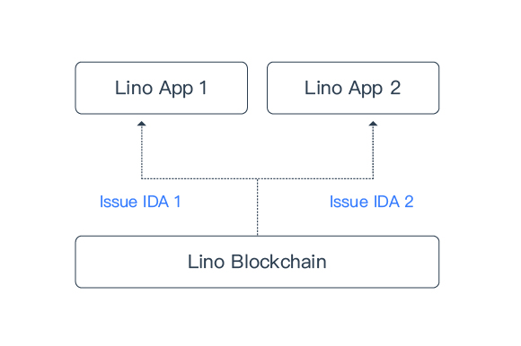

# In-app Digital Asset(IDA)

Due to the volatile nature of cryptocurrencies, large price swings are inevitable and hence they are not optimal to be used for daily transactions. Just imagine: A 20% drop in your cryptocurrency value for the past months earnings due to fluctuations in price. Which content creator would find this acceptable? That’s why IDA is designed to be used for donations and gifting without worrying about price fluctuation. Moreover, IDA is superior to fiat currencies in the Lino model since it’s programmable and all related economic behaviors can be recorded onto the blockchain.

Lino Apps are recommended to use IDA for better user experience. Lino App users will be able to purchase IDA at a fixed price. Any donation and paid subscription on the Lino App will be transacted via IDA.

## IDA Features

### Fixed Price

The issuing developer will declare the name and USD price at the creation of an IDA that cannot be changed later.

### In-app Usage Only

An IDA cannot be used outside of the issuing App developer. Any IDA usage requires the signature of the issuing developer account or affiliated developer accounts.

### Donation Only

Only the issuing developer and affiliated developer accounts can transfer IDA. App users can only donate IDA. For any IDA donation, the recipient will receive 90.1%, and the rest 9.9%will be automatically converted to LINO (the LINO comes from the **Reserve Pool**, see below) based on the **Consensus Rate of LINO** (see below) and distributed to LINO Stake holders.

## Consensus Rate of LINO

The Consensus Rate of LINO is calculated on-chain based on LINO prices reported by all [validators](about) of Lino blockchain.

Specifically, the validators will continuously update their LINO prices to the Lino blockchain. The validators can pull the LINO price data directly from reliable sources. Lino blockchain will compute a **weighted median** of LINO prices, called a **Price Point**, reported by all validators based on their [Committing Powers](../blockchain/validator.html#committing-power) every hour. The weighted median can guarantee the accuracy of Price Point will be maintained even if there are few outliers.

The Consensus Rate of LINO, that is updated very hour, is the **median** of the last 36 Price Points.

## Reserve Pool

At the initiation of the Lino blockchain, the Reserve Pool contains 1 billion LINO, which is 10% of the total supply (10 billion). The Reserve Pool is an on-chain smart contract that is not controlled by any individual or entity.

The Reserve Pool operates based on the following rules:

### In-flow

Whenever a developer wants to mint IDA, the developer needs to send LINO to the Reserve Pool as collateral, and new IDA will be minted. The amount of newly minted IDA is calculated based on the USD price of the IDA and the Consensus Rate of LINO.

For instance, the current Consensus Rate of LINO is $0.012. If `@dlivetv`, who issued its IDA called `LEMON` with a fixed price of $0.012, sends 100 LINO to the Reserve Pool, `@dlivetv` will receive 100 newly minted `LEMON` in return.

### Out-flow

Whenever a donation is transacted via any IDA, 9.9% of it will be converted to LINO automatically at the Consensus Rate of LINO to distribute to LINO Stake holders. Specifically, the 9.9% IDA will be destroyed, and the corresponding LINO will be deducted from the Reserve Pool to distribute to the LINO Stake holders.

## Converting IDA Back To LINO

IDA can only be converted to LINO in the following two ways:

1. Whenever a donation is transacted via any IDA, 9.9% of it will be converted to LINO automatically at the Consensus Rate of LINO and distributed to LINO Stake holders.

2. When an [IDA Conversion Proposal](about) is approved, all the IDA, for example, `LEMON` (the IDA issued by `@dlivetv`), will be converted to LINO automatically at the Consensus Rate of LINO. Specifically, all `LEMON` will be destroyed, and the corresponding LINO will be deducted from the Reserve Pool and credited to the previous `LEMON` holders. This situation happens typically when the developer wants to destroy the IDA or the developer fails their users.

## IDA Authorization

Since the creation of IDA, the issuing developer in default has the access to donate and transfer the IDA from any account. A user can unauthorize an App to revoke the developer’s access to the user’s IDA. After unauthorization, the developer can no longer transfer or donate IDA on behalf of this user. However, the user does not have access to donate or transfer the IDA either. In this case, the user can only reauthorize or wait for the [IDA Conversion Proposal](about) to be approved to convert the IDA to LINO.
