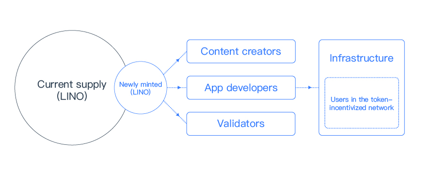

# Block Rewards Distribution

LINO is the fundamental unit of value on the Lino blockchain. The Lino blockchain is designed to algorithmically reward all contributors with the Block Rewards, i.e., newly minted LINO that is produced per block(or per a certain number of blocks). 15% goes to Validators; 10% goes to content creators; 75% goes to Lino App developers. Note that Lino App developers will use most part of the 75% to cover the infrastructure cost and to reward the viewers in the [Token-incentivized NDN layer](../blockchain/ndn.html).

An annual inflation mechanism not exceeding 6.5% is also built into the LINO blockchain. This system is designed to ensure that App developers, validators, and content creators are fully compensated for their contributions to achieve long-term sustainability.

