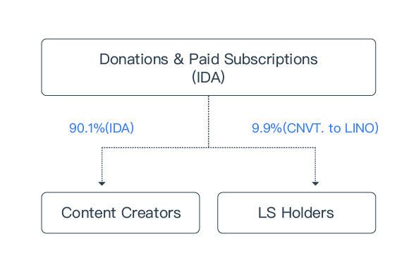
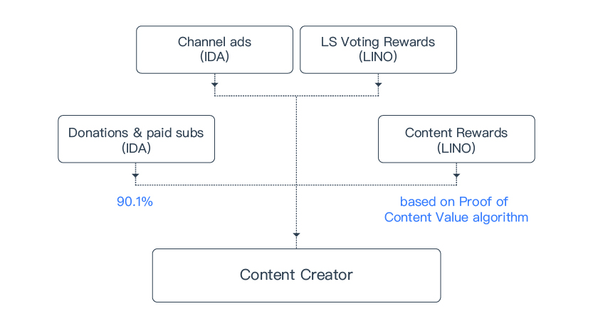
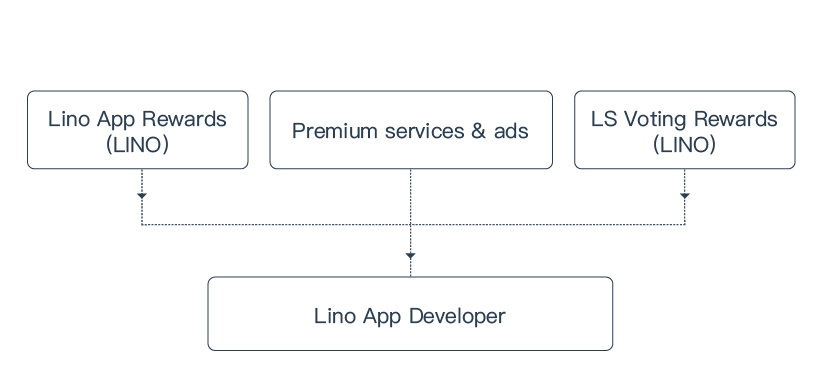

# Contributors to the Lino Blockchain

## Validators

Validators produce blocks and validate messages on the blockchain and receive [message fees](/blockchain/fee.html#general-messages-gm) in return. They are also rewarded by Block Rewards/Validator Rewards and LS Voting Rewards. A minimum amount of [LS](../overview/ls.html#voting-rewards) is required to be a validator.

## Content Creators

Content creators produce and publish original content, including videos and live streams. They are the most critical contributors to any content sharing platform, and the Lino blockchain is designed to fully incentivize them to continuously produce high-quality content, keeping the whole ecosystem robust in the long term.

90.1% of all donations and paid subscriptions made in [In-app Digital Asset(IDA)](../blockchain/ida.html) using the Lino blockchain will be paid algorithmically to the content creators, and the remaining 9.9% will be held in reserve by the blockchain protocol and distributed to all [Lino Stake](../overview/ls.html) holders as **Voting Rewards** for their contribution to blockchain governance. Apps utilizing the Lino blockchain protocol should not take cuts from donations, paid subscriptions, and any other transactions between content creators and viewers.

In addition, content creators will receive Content Rewards in LINO based on the performance of their content. An algorithm called Proof of Content Value is built into the Lino blockchain to allocate Content Rewards fairly and prevent bots from abusing the system. A content creator can also receive income from LS Voting Rewards and channel ads.

The specific amount of Content Rewards allocated to each content creator is based on a built-in algorithm on Lino blockchain, called [Proof of Content Value](../blockchain/pocv.html).

Proof of Content Value is a built-in algorithm in the Lino blockchain. It takes users’ donation-transactions as input, and computes the specific amounts of Content Rewards allocated to each content. More details can be found in the [Technical Whitepaper](https://vsce.shortcm.li/kFzXLQ).

## App Developers

App developers can build apps using the infrastructure provided by the Lino blockchain for content creators and viewers. A minimum amount of [LS](../overview/ls.html) is required to be an App Developer.

While App developers should not take any cut from viewers’ direct payment to content creators, they will be compensated by the Lino App Rewards and the LS Voting Rewards as LS holders. Lino Apps can also profit from their own premium services and ads.
