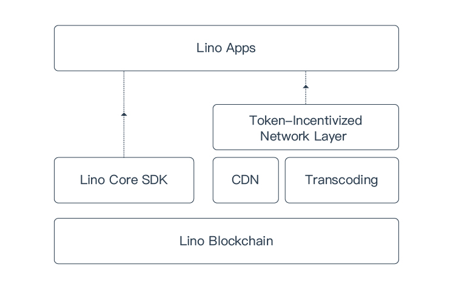

# Introduction

The mission of Lino blockchain is to facilitate a **Value-sharing Content Economy** where content creators, viewers, and all other contributors are fully and fairly incentivized to maximize long-term economic growth in a sustainable way.

## LINO

LINO is the fundamental unit of value on Lino blockchain. Lino blockchain is designed to algorithmically reward all contributors with newly minted LINO that is produced per block. You can access your LINO by registering an account on [Lino Wallet](https://account.lino.network).
## Lino Blockchain Highlights

### Earn LINO While Watching on Lino Apps

Leveraging the [token-incentivized NDN](../blockchain/ndn.html), viewers can utilize their idle network bandwidth and computing resources to provide infrastructure to Lino blockchain while earning LINO as rewards at the same time. In other words, viewers will be able to earn while watching on Lino Apps.

### No Platform Cut

Apps utilizing the Lino blockchain do not take any cuts from direct payments between viewers and content creators. 90.1% of any consumption(donation, paid subscription, and etc) will directly go to content creators, while the rest 9.9% will rewards [LINO Stake](../overview/ls.html) holders for voting.

### In-app Digital Asset (IDA)

An App developer on Lino blockchain can issue its own fix-priced [IDA](../blockchain/ida.html) that can be used within that app only. IDA, for the first time, makes blockchain-based applications more user-friendly to non-crypto users.

### Voting Rewards

[LINO Stake](../overview/ls.html) holders vote on [validator](../blockchain/validator.html) election as well as [governance proposals](../blockchain/governance.html), and receive [Voting Rewards](../overview/ls.html#voting-rewards) in return. The Voting Rewards come from 9.9% of all consumptions on Lino blockchain.

### Decentralized Ownership

LINO Stake is the proof of ownership of Lino blockchain. LINO Stake holders will elect the validators and vote for the future updates on Lino blockchain. By decentralizing the ownership, all contributors to Lino blockchain, including developers and content creators, will strive for the prosperity of the Lino ecosystem together.

## Consensus Algorithm

Lino blockchain is based on the Byzantine Fault Tolerance(BFT) based Proof-of-Stake(PoS) consensus algorithm, particularly the open source projects [Tendermint](https://tendermint.com/) and [Cosmos](https://cosmos.network/).

## Blockchain Architecture

