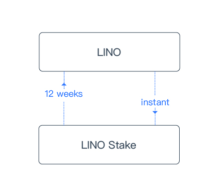

# LINO Stake(LS)

Different from LINO, LS is designed for long-term supporters of the network and is **non-transferrable**. LS is a feature designed in the Lino blockchain whereby, by staking LINO into LS, holders can

1. participate in the [governance system](about) and propose and vote on parameter changes and system upgrade proposals.

2. vote on [validator election](about).

3. become an [App developer](about), or a [validator](about).

The ownership of the Lino blockchain is expected to become more decentralized as more people hold LS. Major decisions will be voted on by LS holders under the governance system.

## Voting Rewards

LS holders will be able to get **Voting Rewards** based on their contributions to the network when they vote on proposals or validator election. Voting Rewards are paid out daily from the **9.9%** of donations and paid subscriptions on all Lino Apps.

## Conversion

**Stake In**: Stake In is the process of converting LINO to LS, which is instant.

**Stake Out**: Stake Out is the process of converting LS to LINO. It takes 12 weeks, called the Pending Period, to convert LS back to LINO completely. During the 12-week Pending Period, 1/12 LS will be converted to LINO at the end of each week.
